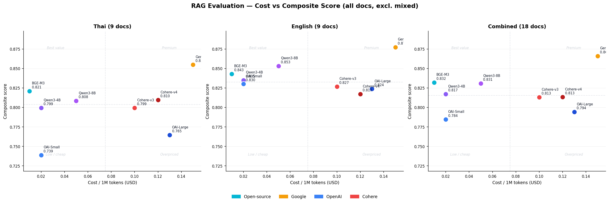
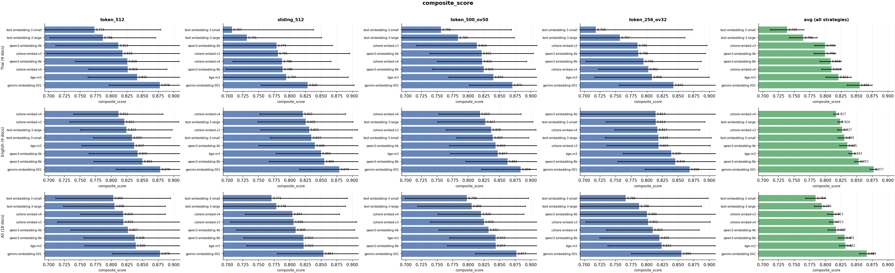
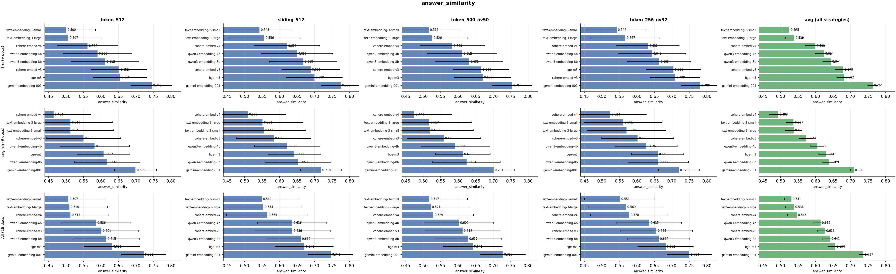
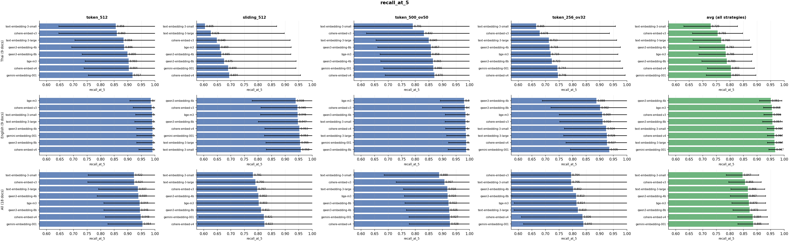
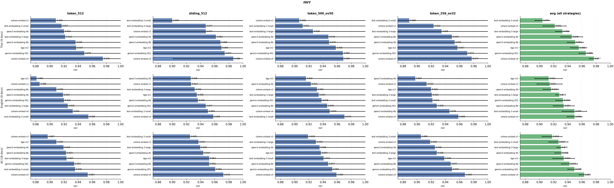
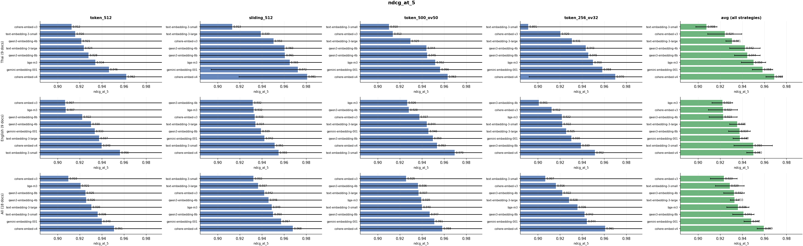
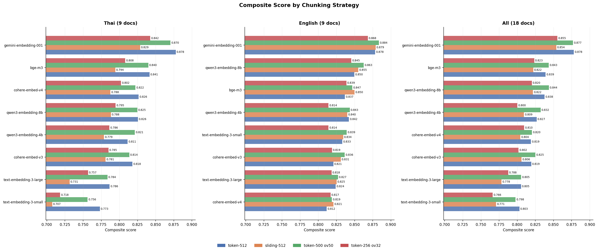

# Embedding Model Evaluation — Detailed Analysis

> **Dataset:** 12,000 evaluation rows across 8 models × 4 chunking strategies × 18 non-mixed documents × 20 questions each  
> **Metrics:** Recall@5, MRR, NDCG@5, Answer Similarity, Composite Score  
> **Documents:** 9 Thai–English document pairs from 6 domains (IT Service, E-Commerce, Legal, Investment, Insurance, Banking)

---

## 1. Overall Model Ranking

| Rank | Model | Composite Score | Cost / 1M tokens | Tier |
|------|-------|:--------------:|-----------------|------|
| 1 | **gemini-embedding-001** | **0.8660** | $0.15 | Commercial |
| 2 | bge-m3 | 0.8320 | $0.01 | Open-source (via OpenRouter) |
| 3 | qwen3-embedding-8b | 0.8308 | $0.05 | Open-source (via OpenRouter) |
| 4 | qwen3-embedding-4b | 0.8171 | $0.02 | Open-source (via OpenRouter) |
| 5 | cohere-embed-v3 | 0.8130 | $0.10 | Commercial |
| 6 | cohere-embed-v4 | 0.8129 | $0.12 | Commercial |
| 7 | text-embedding-3-large | 0.7940 | $0.13 | Commercial |
| 8 | text-embedding-3-small | 0.7845 | $0.02 | Commercial |

**Cost vs Composite Score — Thai / English / Combined**



### Key Observations

- **Gemini-embedding-001** เป็นตัวที่ดีที่สุดในทุกมิติ ห่างอันดับ 2 ประมาณ 0.034 คะแนน (composite) โดยมีค่า Answer Similarity สูงที่สุดอย่างชัดเจน (0.7365) ซึ่งบ่งชี้ว่า embedding space ของ Gemini จับ semantic meaning ของคำตอบได้ดีกว่าโมเดลอื่น
- **bge-m3 และ qwen3-embedding-8b** เป็น open-source ที่ประสิทธิภาพสูงสุด และเมื่อเทียบกับ commercial models ที่ราคาสูงกว่ามาก (Cohere $0.10–0.12/M) กลับได้คะแนนดีกว่า — ทำให้เป็น **Best Value** อย่างชัดเจน
- **Cohere v4 vs v3:** ราคาเท่ากัน แต่ composite score เกือบเท่ากัน (0.8129 vs 0.8130) ความแตกต่างคือ v4 มี retrieval สูงกว่า (Recall 0.889, NDCG 0.958) แต่ Answer Similarity ต่ำกว่า (0.542 vs 0.626) อย่างชัดเจน ซึ่งหมายความว่า v4 ดึง chunk ที่ถูกต้องมาได้มากขึ้น แต่ embedding space ตอบ answer-chunk alignment ได้แย่ลง
- **text-embedding-3-large** แม้จะเป็นโมเดลที่ใหญ่และแพงที่สุดในกลุ่ม OpenAI แต่ได้คะแนนต่ำกว่า open-source ทุกตัว — คุ้มค่าน้อยที่สุด
- **text-embedding-3-small** เป็น commercial ที่ถูกที่สุด ($0.02/M) แต่คะแนนต่ำสุด

---

## 2. Metric Breakdown per Model

| Model | Recall@5 | MRR | NDCG@5 | Answer Sim | Composite |
|-------|:--------:|:---:|:------:|:----------:|:---------:|
| gemini-embedding-001 | 0.8855 | 0.9493 | 0.9481 | **0.7365** | **0.8660** |
| bge-m3 | 0.8697 | 0.9342 | 0.9361 | 0.6564 | 0.8320 |
| qwen3-embedding-8b | 0.8727 | 0.9424 | 0.9410 | 0.6413 | 0.8308 |
| qwen3-embedding-4b | 0.8667 | 0.9309 | 0.9325 | 0.6146 | 0.8171 |
| cohere-embed-v3 | 0.8555 | 0.9178 | 0.9233 | 0.6263 | 0.8130 |
| cohere-embed-v4 | **0.8888** | **0.9611** | **0.9580** | 0.5419 | 0.8129 |
| text-embedding-3-large | 0.8664 | 0.9298 | 0.9327 | 0.5383 | 0.7940 |
| text-embedding-3-small | 0.8466 | 0.9267 | 0.9287 | 0.5310 | 0.7845 |

**Composite Score per Model × Strategy**



**Answer Similarity per Model × Strategy**



**Recall@5 per Model × Strategy**



**MRR per Model × Strategy**



**NDCG@5 per Model × Strategy**



### Observations

- **Recall, MRR, NDCG:** โมเดลส่วนใหญ่ได้คะแนนใกล้เคียงกันในกลุ่มนี้ (0.85–0.96) — cohere-embed-v4 ชนะสูสีที่สุดในทั้งสามมิตินี้ แต่กลับไม่ได้ composite สูงสุด
- **Answer Similarity เป็น differentiator หลัก:** Gemini (0.7365) ห่างจากอันดับ 2 (bge-m3: 0.6564) ถึง 0.08 คะแนน ซึ่งเป็นช่องว่างที่ใหญ่ที่สุดระหว่าง metrics ทั้งหมด — บ่งชี้ว่า Gemini เข้าใจ semantic content ในเชิงลึกกว่า
- **Cohere v4 anomaly:** Recall สูงมาก (0.889) แต่ Answer Similarity ต่ำ (0.542) กว่า cohere-embed-v3 ซึ่งมี Recall ต่ำกว่า (0.856) — แสดงว่า v4 ดึง chunk ที่ "มีคำที่เกี่ยวข้อง" ได้ดี แต่ไม่ใช่ chunk ที่ "ตอบคำถามได้ดีที่สุด" ในเชิง semantic

---

## 3. Chunking Strategy Analysis



| Strategy | Mean Composite | Std | หมายเหตุ |
|----------|:--------------:|:---:|---------|
| **token_500_ov50** | **0.8306** | 0.0833 | 500 tokens, overlap 50 |
| token_512 | 0.8282 | 0.0882 | 512 tokens, no overlap |
| sliding_512 | 0.8083 | 0.0996 | 512 tokens, sliding window |
| token_256_ov32 | 0.8080 | 0.1021 | 256 tokens, overlap 32 (เล็กสุด) |

### Best Strategy per Model

| Model | Best Strategy | Score |
|-------|--------------|:-----:|
| gemini-embedding-001 | token_512 | 0.8780 |
| text-embedding-3-small | token_512 | 0.8031 |
| bge-m3 | token_500_ov50 | 0.8434 |
| qwen3-embedding-8b | token_500_ov50 | 0.8437 |
| qwen3-embedding-4b | token_500_ov50 | 0.8323 |
| cohere-embed-v3 | token_500_ov50 | 0.8250 |
| cohere-embed-v4 | token_500_ov50 | 0.8205 |
| text-embedding-3-large | token_500_ov50 | 0.8054 |

> Generate strategy comparison chart: `python 07_plot_strategy_comparison.py`

### Observations

- **token_500_ov50** ชนะในโมเดลส่วนใหญ่ (6/8 โมเดล) — การ overlap 50 tokens ช่วยให้ context ที่อยู่ตรงรอยต่อของ chunk ไม่หายไป ส่งผลดีต่อทั้ง retrieval และ answer similarity
- **token_512 vs token_500_ov50:** ต่างกันเพียง 0.0024 คะแนน (ไม่มีนัยสำคัญ) แต่ token_500_ov50 มีความคงเส้นคงวากว่า (std ต่ำกว่า)
- **sliding_512 ผลลัพธ์ใกล้เคียง token_256_ov32:** แม้ขนาด chunk จะต่างกัน แต่คะแนนเฉลี่ยใกล้กันมาก (0.808 vs 0.808) — แสดงว่า chunk ที่เล็กเกินไปทำให้ขาด context สำคัญ
- **Std ของ token_256_ov32 สูงที่สุด (0.1021):** chunk เล็กทำให้ผลลัพธ์ขึ้นอยู่กับว่าคำตอบตกที่ chunk ไหนมากกว่า ทำให้ variance สูง

---

## 4. Model × Strategy Full Matrix (Composite Score)

| Model | token_512 | token_500_ov50 | sliding_512 | token_256_ov32 |
|-------|:---------:|:--------------:|:-----------:|:--------------:|
| gemini-embedding-001 | **0.8780** | 0.8769 | 0.8538 | 0.8554 |
| bge-m3 | 0.8390 | **0.8434** | 0.8221 | 0.8234 |
| qwen3-embedding-8b | 0.8376 | **0.8437** | 0.8218 | 0.8201 |
| qwen3-embedding-4b | 0.8267 | **0.8323** | 0.8093 | 0.8001 |
| cohere-embed-v3 | 0.8194 | **0.8250** | 0.8059 | 0.8019 |
| cohere-embed-v4 | 0.8174 | **0.8205** | 0.8047 | 0.8090 |
| text-embedding-3-large | 0.8048 | **0.8054** | 0.7783 | 0.7878 |
| text-embedding-3-small | **0.8031** | 0.7976 | 0.7709 | 0.7662 |

### Pattern ที่น่าสนใจ

- **ทุกโมเดลได้คะแนนต่ำสุดกับ sliding_512 หรือ token_256_ov32** — ยืนยันว่า chunk เล็กไม่ใช่ตัวเลือกที่ดีสำหรับ document ประเภทนี้
- **Gemini มีความ robust สูงกว่าโมเดลอื่น:** spread ระหว่าง best/worst strategy คือ 0.024 ขณะที่ text-embedding-3-small มี spread ถึง 0.037 — แสดงว่า Gemini ทนต่อการเลือก chunking strategy ที่ไม่เหมาะสมได้ดีกว่า

---

## 5. Language Performance (Thai vs English)

| Model | TH Score | EN Score | Gap (TH−EN) |
|-------|:--------:|:--------:|:-----------:|
| text-embedding-3-small | 0.7388 | 0.8301 | **−0.0913** |
| text-embedding-3-large | 0.7644 | 0.8237 | −0.0592 |
| qwen3-embedding-8b | 0.8083 | 0.8532 | −0.0449 |
| qwen3-embedding-4b | 0.7994 | 0.8349 | −0.0355 |
| cohere-embed-v3 | 0.7994 | 0.8267 | −0.0274 |
| bge-m3 | 0.8209 | 0.8430 | −0.0221 |
| gemini-embedding-001 | 0.8547 | 0.8773 | −0.0226 |
| cohere-embed-v4 | 0.8087 | 0.8171 | **−0.0085** |

### Observations

- **ทุกโมเดลทำได้แย่กว่ากับภาษาไทย** ซึ่งคาดได้ เนื่องจากภาษาไทยไม่มีตัวแบ่งคำ (whitespace) และ tokenization ซับซ้อนกว่า
- **OpenAI models (text-embedding-3) มี gap กับภาษาไทยสูงที่สุด** (−0.09 ถึง −0.06) สะท้อนว่าโมเดลเหล่านี้ถูก train มา dominant ด้วยภาษาอังกฤษ
- **bge-m3 ออกแบบมาสำหรับภาษาไทยได้ดี** โดยมี gap เพียง −0.022 ซึ่งใกล้เคียง Gemini (−0.023) และถือว่าดีมากสำหรับ open-source model
- **Cohere v4 มี Thai-English gap น้อยที่สุด (−0.009)** บ่งชี้ว่าโมเดลนี้ถูก train ด้วย multilingual data ที่สมดุลกว่า แม้ overall composite จะไม่สูงที่สุด

---

## 6. Performance by Question Type

| Question Type | Overall Avg | Best Model | Best Score |
|---------------|:-----------:|-----------|:----------:|
| factual | 0.8141 | gemini-embedding-001 | 0.8617 |
| multihop | **0.8271** | gemini-embedding-001 | 0.8646 |
| crosslingual | 0.8176 | gemini-embedding-001 | 0.8726 |
| summary | 0.8164 | gemini-embedding-001 | 0.8652 |

### Crosslingual per Model

| Model | Crosslingual Score |
|-------|:-----------------:|
| gemini-embedding-001 | **0.8726** |
| qwen3-embedding-8b | 0.8309 |
| bge-m3 | 0.8307 |
| cohere-embed-v4 | 0.8134 |
| qwen3-embedding-4b | 0.8108 |
| cohere-embed-v3 | 0.8086 |
| text-embedding-3-large | 0.7913 |
| text-embedding-3-small | 0.7826 |

### Observations

- **Multihop questions ได้คะแนนสูงสุด (0.827)** ซึ่งแปลกเล็กน้อย — ปกติคำถามที่ต้องใช้หลาย chunk ควรยากกว่า แต่ผลออกมาดีกว่า factual ซึ่งอาจหมายความว่า ground truth ที่ generate ขึ้น multihop ยังไม่ซับซ้อนพอ หรือ chunk ขนาด 500 tokens ครอบคลุม context ได้ดีพอสำหรับ question ประเภทนี้
- **Crosslingual: Gemini ชนะห่างชัดเจน (0.8726)** ห่างอันดับ 2 ถึง 0.042 คะแนน — แสดงถึงความสามารถ cross-lingual embedding ที่เหนือกว่าอย่างมีนัยสำคัญ
- **bge-m3 ดีมากใน crosslingual (0.8307)** เมื่อเทียบกับขนาดและความฟรี — ถือเป็น open-source ที่เก่งด้าน multilingual มากที่สุด

---

## 7. Performance by Domain

| Domain | Mean Composite | Std | จำนวน rows |
|--------|:--------------:|:---:|--------:|
| Banking (neobank) | **0.8396** | 0.086 | 1,280 |
| Legal (krungthai_legal) | 0.8364 | 0.083 | 1,280 |
| Insurance (shieldauto + thailife) | 0.8349 | 0.091 | 2,560 |
| Investment (alphacapital) | 0.8165 | 0.088 | 1,280 |
| E-Commerce (stylehub + techmart) | 0.8051 | 0.101 | 2,560 |
| IT Service (technest + datastream) | 0.7983 | 0.096 | 2,560 |

### Per-Document Detail

| Document | Mean Composite |
|----------|:--------------:|
| shieldauto (Insurance, EN+TH avg) | 0.8473 |
| neobank (Banking, EN+TH avg) | 0.8396 |
| krungthai_legal (Legal, EN+TH avg) | 0.8364 |
| thailife (Insurance, EN+TH avg) | 0.8225 |
| datastream (IT Service, EN+TH avg) | 0.8187 |
| alphacapital (Investment, EN+TH avg) | 0.8165 |
| techmart (E-Commerce, EN+TH avg) | 0.8082 |
| stylehub (E-Commerce, EN+TH avg) | 0.8020 |
| technest (IT Service, EN+TH avg) | 0.7779 |

### Observations

- **Banking และ Legal ทำได้ดีที่สุด** — เอกสารประเภทนี้มักมีโครงสร้างชัดเจน ข้อมูลตรงไปตรงมา และคำถามสามารถตอบได้จาก chunk เดียว
- **IT Service ทำได้แย่ที่สุด** — เอกสาร technest และ datastream มี jargon เฉพาะทาง คำศัพท์เทคนิค และมักต้องการ context หลาย chunk ประกอบกัน
- **E-Commerce std สูงสุด (0.101)** — ชี้ให้เห็นว่า document ประเภทนี้มีความหลากหลายของคำถามมากที่สุด (product name, price, policy ต่างกัน)
- **Shieldauto เป็น best individual document** — อาจเพราะเนื้อหา Insurance มีโครงสร้างข้อมูลที่เป็น fact-based ชัดเจน (เช่น coverage amounts, policy terms)

---

## 8. Latency Analysis

Latency แบ่งเป็น 2 ส่วนที่วัดแยกกัน:
- **Embed latency** — เวลา HTTP API call จริงต่อ query (bottleneck หลัก)
- **Retrieval latency** — เวลา DB query + cosine similarity ใน Python (local, เร็วมาก)

### 8a. Embedding API Latency (ms/query)

| Model | Median | Mean | P95 |
|-------|:------:|:----:|:---:|
| **cohere-embed-v3** | **23.7 ms** | 26.2 ms | 41.3 ms |
| **cohere-embed-v4** | **23.8 ms** | 30.1 ms | 60.7 ms |
| text-embedding-3-small | 57.7 ms | 63.9 ms | 142.8 ms |
| text-embedding-3-large | 73.1 ms | 76.3 ms | 106.2 ms |
| gemini-embedding-001 | 111.3 ms | 114.3 ms | 145.8 ms |
| qwen3-embedding-8b | 156.5 ms | 172.5 ms | 324.2 ms |
| bge-m3 | 167.8 ms | 186.3 ms | 337.0 ms |
| qwen3-embedding-4b | 190.6 ms | 194.8 ms | **271.1 ms** |

> **หมายเหตุ:** วัดจาก batch embedding (40 texts ต่อ call) หารด้วยจำนวน query เพื่อให้เป็น per-query latency — สะท้อน throughput จริงของ API ไม่ใช่ single-request latency

### 8b. Retrieval Latency (ms/query — local DB + cosine similarity)

| Model | Median | Mean | P95 |
|-------|:------:|:----:|:---:|
| bge-m3 | 1.7 ms | 2.1 ms | 4.4 ms |
| cohere-embed-v3 | 1.9 ms | 2.4 ms | 5.1 ms |
| text-embedding-3-small | 2.5 ms | 3.2 ms | 7.0 ms |
| cohere-embed-v4 | 2.6 ms | 3.5 ms | 7.1 ms |
| qwen3-embedding-4b | 3.7 ms | 4.8 ms | 10.1 ms |
| text-embedding-3-large | 4.3 ms | 5.5 ms | 12.1 ms |
| gemini-embedding-001 | 4.5 ms | 6.0 ms | 13.6 ms |
| qwen3-embedding-8b | 5.9 ms | 7.8 ms | 16.8 ms |

> Retrieval latency ขึ้นกับ **ขนาด embedding dimension** เป็นหลัก (bge-m3: 1024 dim เร็วกว่า qwen3-8b: 4096 dim)

### Observations

- **Cohere (v3 และ v4) มี embed latency เร็วที่สุด (~24 ms)** — เร็วกว่า open-source models via OpenRouter ถึง 7–8× แสดงว่า Cohere API มี infrastructure ที่ optimize สำหรับ embedding โดยเฉพาะ
- **Open-source models (bge-m3, qwen3) ช้าที่สุดใน embed latency (167–191 ms)** — เพราะรัน via OpenRouter ซึ่งมี overhead จากการ relay request ถ้า self-host จะเร็วกว่ามาก
- **Gemini ช้ากว่า Cohere 4–5× (111 ms vs 24 ms)** แม้จะ performance สูงสุด — ต้องพิจารณาหากใช้ใน real-time application
- **Retrieval latency ไม่ใช่ bottleneck** — ทุกโมเดลอยู่ที่ 1–6 ms ซึ่งเร็วมากเนื่องจากคำนวณ local
- **Ranking latency กลับทิศกับ ranking performance** — Cohere เร็วที่สุดแต่ performance ปานกลาง, Gemini ช้ากว่าแต่ performance ดีที่สุด

---

## 9. Cost-Performance-Latency Analysis

### Full Comparison Matrix

| Model | Composite | Cost / 1M | Embed Latency (median) | ประเมิน |
|-------|:---------:|:---------:|:----------------------:|--------|
| gemini-embedding-001 | **0.8660** | $0.15 | 111 ms | ⭐⭐⭐⭐ Best performance, mid latency |
| bge-m3 | 0.8320 | $0.01 | 168 ms* | ⭐⭐⭐⭐⭐ Best value (cost), slow via API |
| qwen3-embedding-8b | 0.8308 | $0.05 | 157 ms* | ⭐⭐⭐⭐ Good value, slow via API |
| qwen3-embedding-4b | 0.8171 | $0.02 | 191 ms* | ⭐⭐⭐⭐ Good value, slowest via API |
| cohere-embed-v3 | 0.8130 | $0.10 | **24 ms** | ⭐⭐⭐ Fast latency, mid performance |
| cohere-embed-v4 | 0.8129 | $0.12 | **24 ms** | ⭐⭐⭐ Fast latency, mid performance |
| text-embedding-3-large | 0.7940 | $0.13 | 73 ms | ⭐ Expensive + poor performance |
| text-embedding-3-small | 0.7845 | $0.02 | 58 ms | ⭐⭐ Cheap but worst performance |

> \* Open-source models รัน via OpenRouter — latency จะลดลงมากหาก self-host บน GPU

### การวิเคราะห์ Trade-off สามมิติ

**1. Performance vs Cost**
- bge-m3 และ qwen3 ให้ performance สูงกว่า Cohere และ OpenAI models ที่แพงกว่า — cost per performance ดีที่สุด
- Gemini ให้ performance สูงสุดในราคา $0.15/M ซึ่งสมเหตุสมผล
- text-embedding-3-large แพง ($0.13/M) แต่ performance ต่ำสุดในกลุ่ม commercial — ไม่คุ้มค่า

**2. Performance vs Latency**
- Cohere เร็วที่สุด (24 ms) แต่ performance อยู่อันดับ 5–6 — เหมาะสำหรับ real-time use case ที่ยอมลด accuracy ได้
- Gemini ช้ากว่า Cohere 4.6× แต่ performance ดีกว่าชัดเจน (composite +0.053)
- Open-source via OpenRouter ช้ามาก (~160–191 ms) เพราะ routing overhead — **ถ้า self-host** latency จะอยู่ที่ ~10–30 ms ซึ่งแข่งขันได้

**3. Cost vs Latency**
- Cohere: เร็ว + แพง ($0.10–0.12/M)
- Open-source via API: ช้า + ถูก ($0.01–0.05/M)
- ถ้า self-host open-source: เร็ว + ถูก (infrastructure cost ตามขนาด GPU) → **optimal สำหรับ production ขนาดใหญ่**

### สรุปข้อเสนอแนะด้าน Cost

- สำหรับ **production ที่ต้องการ performance สูงสุด** → gemini-embedding-001 ($0.15/M) ให้ composite 0.866 และ crosslingual ดีที่สุด latency 111 ms ยอมรับได้สำหรับ batch processing
- สำหรับ **real-time RAG ที่ latency สำคัญ** → cohere-embed-v3 ($0.10/M) เร็วที่สุด 24 ms composite 0.813 ยอมรับได้
- สำหรับ **production ที่ต้องการประหยัดค่าใช้จ่าย (API)** → bge-m3 ($0.01/M) ให้ composite 0.832 ถูกกว่า Gemini 15× แต่ latency สูงหากใช้ via OpenRouter
- สำหรับ **production ขนาดใหญ่ที่มี GPU** → self-host bge-m3 หรือ qwen3-embedding-8b — ได้ทั้ง performance ดี, latency ต่ำ, และไม่มีค่า per-token
- **ไม่แนะนำ** text-embedding-3-large ($0.13/M) — performance ต่ำกว่า open-source ทุกตัว แต่แพงกว่า bge-m3 ถึง 13×

---

## 10. Summary and Recommendations

### ผลลัพธ์หลัก

1. **gemini-embedding-001 ชนะทุก benchmark** โดยเฉพาะ Answer Similarity (0.737) และ crosslingual tasks (0.873) — ห่างจากคู่แข่งอย่างชัดเจน แต่มี embed latency 111 ms ซึ่งต้องพิจารณาสำหรับ real-time use case
2. **Open-source models (bge-m3, qwen3) ให้ค่าคุ้มด้าน cost ดีที่สุด** — bge-m3 ($0.01/M) ชนะ Cohere ($0.10–0.12/M) และ OpenAI 3-large ($0.13/M) ด้วยต้นทุนต่ำกว่า 10–13× แต่เมื่อใช้ via OpenRouter มี latency สูง (~168 ms) — self-host แก้ได้
3. **Cohere เร็วที่สุด (24 ms)** เหมาะสำหรับ real-time application แต่ performance อยู่อันดับ 5–6 และค่าใช้จ่ายสูงกว่า open-source มาก
4. **token_500_ov50 เป็น chunking strategy ที่ดีที่สุดโดยรวม** (6/8 โมเดลเลือกเป็น best) — overlap ช่วยลด information loss ที่ขอบ chunk
5. **ภาษาไทยยังคงเป็นความท้าทาย** — ทุกโมเดลทำได้แย่ลงกับ Thai documents, OpenAI models มี gap มากที่สุด (−0.09)
6. **Insurance และ Banking documents ง่ายกว่า IT Service** สำหรับ embedding-based retrieval
7. **Retrieval latency ไม่ใช่ bottleneck** (1–6 ms ทุกโมเดล) — embed API call คือ bottleneck จริงซึ่งอยู่ที่ 24–191 ms

### คำแนะนำตาม Use Case

| Use Case | แนะนำ | Composite | Embed Latency | Cost |
|----------|-------|:---------:|:-------------:|:----:|
| Performance-first RAG | **gemini-embedding-001 + token_512** | 0.866 | 111 ms | $0.15/M |
| Real-time RAG (latency < 50ms) | **cohere-embed-v3 + token_500_ov50** | 0.813 | 24 ms | $0.10/M |
| Cost-sensitive, API-based | **bge-m3 + token_500_ov50** | 0.832 | ~168 ms | $0.01/M |
| Self-hosted GPU production | **qwen3-embedding-8b + token_500_ov50** | 0.831 | ~10–30 ms† | infra cost |
| Thai-centric RAG | **bge-m3 + token_500_ov50** | 0.821 (TH) | ~168 ms | $0.01/M |
| **หลีกเลี่ยง** | text-embedding-3-large | 0.794 | 73 ms | $0.13/M |

> † Self-hosted latency ประมาณจาก GPU inference benchmark ไม่ใช่ค่าที่วัดในการทดลองนี้

### Decision Framework

```
ต้องการ latency < 50ms?
  ├─ ใช่ → Cohere (v3 หรือ v4) — เร็วที่สุด, performance ปานกลาง
  └─ ไม่ใช่ → Performance สำคัญสูงสุด?
               ├─ ใช่ → Gemini-embedding-001 — composite สูงสุด, crosslingual ดีที่สุด
               └─ ไม่ใช่ → มี GPU self-host?
                            ├─ ใช่ → qwen3-embedding-8b หรือ bge-m3 (self-host)
                            └─ ไม่ใช่ → bge-m3 via OpenRouter — ถูกที่สุด, performance ดี
```

---

*Analysis generated from 12,000 evaluation rows — 8 models × 4 strategies × 18–19 documents × 20 questions per document*
